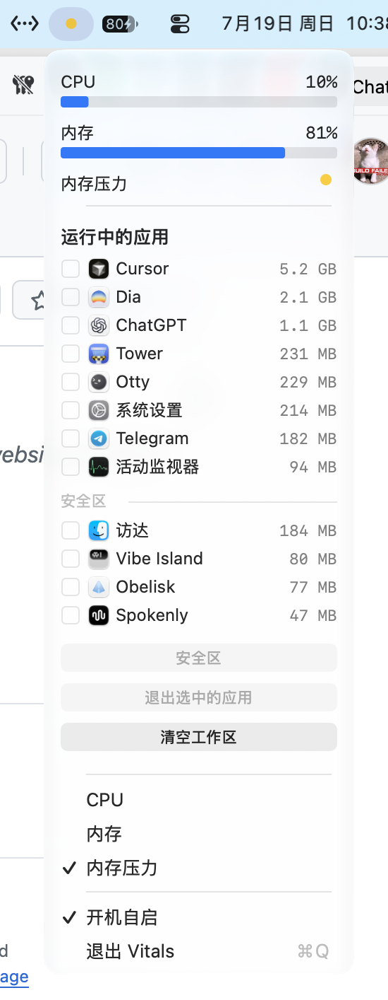

<p align="center">
  
</p>

<h1 align="center">Vitals</h1>

<p align="center">
  A lightweight system monitor that lives in the macOS menu bar.<br>
  CPU, memory, memory pressure, and one-click workspace clearing.
</p>


<p align="center">
  <a href="https://github.com/imeelinew/Vitals/releases">Download</a> ·
  <a href="#install">Install</a> ·
  <a href="#build-from-source">Build from source</a>
</p>

<p align="center">
  <a href="README.en.md">English</a>
  <a href="README.md">简体中文</a>
</p>

<p align="center">
  <a href="https://github.com/imeelinew/Vitals/releases/latest"></a>
  
  
</p>

---

<p align="center">
  
</p>

## About

Vitals is a menu-bar macOS system monitor for people who want a quick view of CPU, memory, and memory pressure, and an easy way to quit memory-heavy apps and clear the workspace.

It stays intentionally light: the menu UI is drawn with native AppKit, avoiding heavy dependencies like SwiftUI, so the monitor itself does not become part of the problem.

## Why Vitals

Activity Monitor is complete, but heavy for “glance at resources, quit a few apps.” Vitals puts the common actions in the menu bar: status at a glance, apps sorted by memory, and a safe zone that never gets cleared by bulk quit.

- **Menu bar first**: CPU, memory usage, and memory pressure sit at the top of the panel.
- **Memory-sorted app list**: see regular running apps with icons and footprints.
- **Safe zone**: protect apps you do not want bulk-quit to touch.
- **Clear workspace**: quit unprotected apps in one action to free memory and desktop space.
- **Lightweight always-on**: sampling and UI are constrained for a low physical footprint while staying in the menu bar.

## Menu Bar

Open the menu for CPU and memory bars, a memory-pressure indicator, and the running-app list. Quit selected apps, or clear the workspace; safe-zone apps are listed separately and excluded from bulk actions.

## More features

- Choose whether the menu bar shows CPU, memory, and memory pressure
- Launch at login
- Quitting selected apps also closes all of their windows
- App icons shown beside memory usage for quick recognition
- Panel views are destroyed when the menu closes to avoid resident memory cost

## Install

Download the latest build from the [Releases page](https://github.com/imeelinew/Vitals/releases), then drag `Vitals.app` into Applications. Requires macOS 26 or later.

## Build from source

```sh
xcodebuild -project Vitals.xcodeproj -scheme Vitals -configuration Release build
```

The app lands in DerivedData under `Build/Products/Release/Vitals.app`. Release builds enable dead-code stripping and strip for footprint checks.
